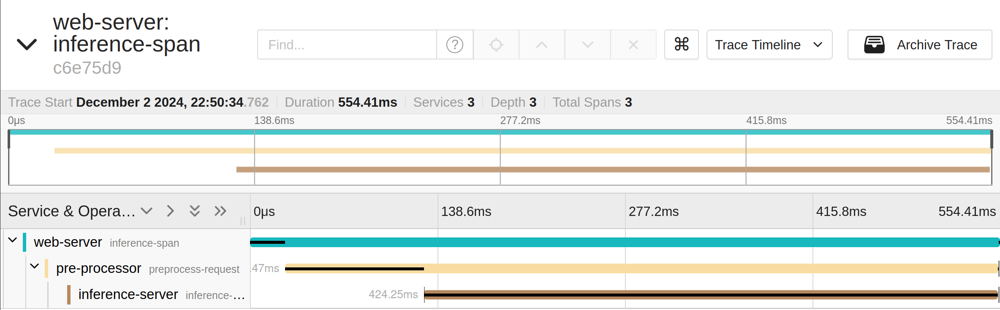
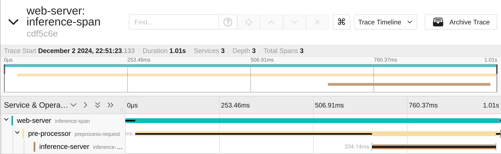

# Advanced Topics in Software Systems (SYS4BIGML) project

> [!NOTE]
> The application is based on the tutorial on ML Monitoring at [github](https://github.com/rdsea/sys4bigml/tree/master/tutorials/MLMonitoring).
> It has been manually updated where the tracing event is added with LLM

## Application

- Machine-learning pipeline

---

## How to evaluate LLM

- <mark style="background: #FF5582A6;">Human annotations</mark>
- Turing test
- Metrics
  - Automated metrics such as RAGAS
- Protocols
- Existing benchmark:
  - [evalchemy](https://github.com/mlfoundations/Evalchemy)
  - [AgentBench](https://github.com/THUDM/AgentBench)
- LLM as a judge

---

## On-call Engineering (OCEs)

- The person that is responsible to solve the incident when it happens
- Tasks
  - Check alerts and notification
  - Acknowledge the problems
  - Assess severity
  - Communicate with relevant stakeholders
  - Find the incident's root cause
    - Checking traces: a normal trace is around 1000 tokens
  - Suggest the mitigation steps for the incident
  - Act according to runbook -> good data for RAG: [examples](https://github.com/runbear-io/awesome-runbook?tab=readme-ov-file#runbook-software)
- Previous incident database

---

## LLM Configuration

- Vanilla LLMs
  - [[Zero-shot prompting]]
  - [[Few-shot prompting]]
  - ...
- Augmented LLMs
  - Retrieval-augmented generation(RAG)
  - Tools

## Root cause analysis task

- Increasing the workload from 1 req/s to 3 req/s
- We can easily see that the problem is in the pre-processor as it's taking too much time to process the image

|           Normal            |           Spiked            |
| :-------------------------: | :-------------------------: |
|  |  |

## Models used

| Model       | Parameters (Billion) | Context Length (Tokens) |
| ----------- | -------------------- | ----------------------- |
| Phi3 Medium | 14B                  | 4K                      |
| Phi3 Mini   | 3.8B                 | 4K                      |
| Mistral     | 7B                   | 8K                      |
| Llama3.2 3B | 3B                   | 128K                    |
| Stable-code | 3B                   | Up to 100K              |
| Code Llama  | 7B                   | Up to 100K              |
| ChatGPT 3.5 | 1.3B-13B (varies\*)  | 4K-32K (varies\*\*)     |
| ChatGPT 4o  | 1.7B-175B (varies\*) | 8K-128K (varies\*\*)    |

- Temperature 0.2

## Results

<table class="tg">
  <thead>
    <tr>
      <th class="tg-0lax">Configuration</th>
      <th class="tg-0lax">Model</th>
      <th class="tg-0lax">Results</th>
    </tr>
  </thead>
  <tbody>
    <tr>
      <td class="tg-0lax" rowspan="8">Zero-shot prompting</td>
      <td class="tg-0lax">Phi3 medium</td>
      <td class="tg-0lax">2/5</td>
    </tr>
    <tr>
      <td class="tg-0lax">Phi3</td>
      <td class="tg-0lax">0/5 (hallucination)</td>
    </tr>
    <tr>
      <td class="tg-0lax">Mistral</td>
      <td class="tg-0lax">1/5</td>
    </tr>
    <tr>
      <td class="tg-0lax">Llama3.2 3B</td>
      <td class="tg-0lax">2/5</td>
    </tr>
    <tr>
      <td class="tg-0lax">Stable-code</td>
      <td class="tg-0lax">0/5 (doesn't compare the trace)</td>
    </tr>
    <tr>
      <td class="tg-0lax">Code Llama</td>
      <td class="tg-0lax">3/5</td>
    </tr>
    <tr>
      <td class="tg-0lax">ChatGPT 4o</td>
      <td class="tg-0lax">5/5</td>
    </tr>
    <tr>
      <td class="tg-0lax">ChatGPT 3.5</td>
      <td class="tg-0lax">0/5</td>
    </tr>
    <tr>
      <td class="tg-0lax" rowspan="8">With tools+Zero-shot prompting</td>
      <td class="tg-0lax">Phi3 medium</td>
      <td class="tg-0lax">Doesn't support tools</td>
    </tr>
    <tr>
      <td class="tg-0lax">Phi3</td>
      <td class="tg-0lax">Doesn't support tools</td>
    </tr>
    <tr>
      <td class="tg-0lax">Mistral</td>
      <td class="tg-0lax">0/5</td>
    </tr>
    <tr>
      <td class="tg-0lax">Llama3.2 3B</td>
      <td class="tg-0lax">3/5</td>
    </tr>
    <tr>
      <td class="tg-0lax">Stable-code</td>
      <td class="tg-0lax">Doesn't support tools</td>
    </tr>
    <tr>
      <td class="tg-0lax">Code Llama</td>
      <td class="tg-0lax">Doesn't support tools</td>
    </tr>
    <tr>
      <td class="tg-0lax">ChatGPT 4o</td>
      <td class="tg-0lax">1/3 (mostly code error but gpt4o knows the error and try to fix it)</td>
    </tr>
    <tr>
      <td class="tg-0lax">ChatGPT 3.5</td>
      <td class="tg-0lax">0/4 (mostly code error)</td>
    </tr>
  </tbody>
</table>

## Lessons

- Auto instrumentation has too much unnecessary information but manual instrumentation takes times and the code looks bad
- Bigger model is not always better (phi3 vs llama3.2)
- Different components of a LLM agent and how they work -> Building an LLM agent is hard!!
- When building an LLM agent for a specific task, use the as specific tools and RAG as possible. Don't just give a general tool like Python code execution to the agent
- LLM observability is a must, it's very hard to debug an LLM-based system. Some good examples:
  - LangSmith
  - Langfuse
  - Phoenix
